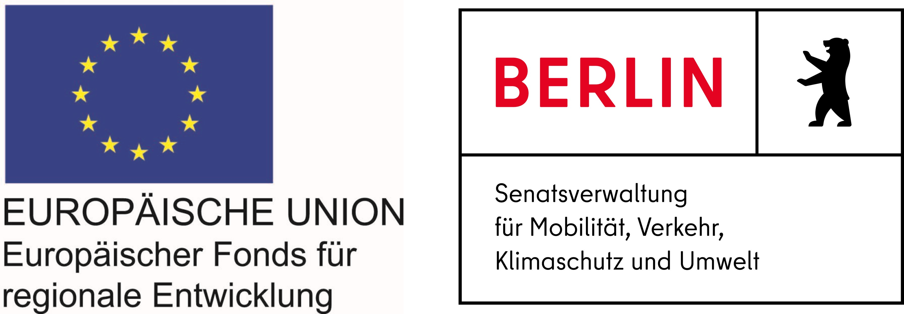

# BENE - Reisebusstrategien für Berlin

This repository contains the VSP code for the BENE project.

Project information can found [here](https://www.tu.berlin/strassenplanung/forschung/projekte/aktuelle-projekte/reisebusverkehr-in-grossstaedten).

Project results can found [here](https://vsp.berlin/bene).

## Project funding partners

